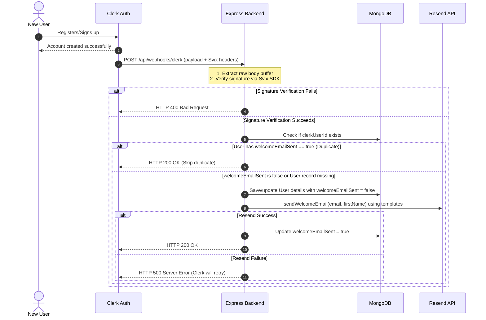

# 🎨 SketchOn

> A state-of-the-art collaborative visual workspace and AI-powered diagramming application.

SketchOn is a modern collaborative whiteboard and diagramming application built using the MERN stack. It allows users to brainstorm, design, and interact with schemas, system architectures, and drawings on a canvas powered by React Flow and Framer Motion. With integrated AI analysis and a secure, verified onboarding email system, SketchOn is a production-grade platform for visual collaboration.

---

## ⚡ Core Features

* **Infinite Interactive Canvas:** Create complex system diagrams, mind maps, and workflow charts using a fully responsive, zoomable canvas built with React Flow.
* **AI Diagram Analysis:** Upload or build diagrams and get intelligent reviews, architecture suggestions, and node generation via integrated AI models.
* **Seamless Authentication:** Enterprise-ready user management and secure authentication flows powered by Clerk.
* **Secure Webhook Pipeline:** Real-time user synchronization using Clerk Webhooks, protected by Svix cryptographic signature verification.
* **Personalized User Onboarding:** Automated delivery of professional, responsive HTML onboarding emails via Resend on new registration.
* **Credit & Subscription System:** Multi-tier plan support (Basic & Pro) and credit-based system for AI queries.
* **Premium User Experience:** Sleek dark-mode aesthetic with custom animations powered by Framer Motion.

---

## 🛠️ Technology Stack

| Layer | Technology | Key Usage |
| :--- | :--- | :--- |
| **Frontend** | React 19, Vite, React Router v7 | Fast build times, HMR, and smooth routing |
| **Styling** | Tailwind CSS v4, Framer Motion | Modern utility-first styling and micro-animations |
| **Canvas** | React Flow | Node-based whiteboard, edge rendering, and connection logic |
| **Backend** | Node.js, Express.js | Production-ready RESTful APIs and server routes |
| **Database** | MongoDB, Mongoose | Schema validation, user indexing, and diagram storage |
| **Auth** | Clerk | Multi-tenant user auth, sessions, and webhook dispatch |
| **Security** | Svix Webhook SDK, CORS | Secure, encrypted webhook verification and server origin configuration |
| **Emails** | Resend SDK | Fast SaaS onboarding emails utilizing HTML templates |

---

## 🛰️ System Architecture & Webhook Flow

Below is the execution sequence when a new user registers on SketchOn:



---

## 🚀 Getting Started

### Prerequisites
* **Node.js** (v18.0.0 or higher)
* **MongoDB** (Local instance or MongoDB Atlas Connection string)
* **Clerk Developer Keys**
* **Resend API Key**

---

### Environment Setup

Create `.env` files in both the frontend and backend folders.

#### 1. Backend Configuration
Create `backend/.env` with the following variables:
```env
PORT=4000
MONGODB_URI=mongodb+srv://<username>:<password>@cluster.mongodb.net/sketchon
CLERK_SECRET_KEY=sk_test_xxx
CLERK_WEBHOOK_SECRET=whsec_xxx       # Obtained from Clerk Dashboard -> Webhooks -> Signing Secret
RESEND_API_KEY=re_xxx
APP_URL=http://localhost:5173
NODE_ENV=development
```

#### 2. Frontend Configuration
Create `frontend/.env` with the following variables:
```env
VITE_CLERK_PUBLISHABLE_KEY=pk_test_xxx
```

---

### Installation & Launch

#### Step 1: Run the Backend
```bash
cd backend
npm install --legacy-peer-deps
npm run dev
```
The server will start on `http://localhost:4000`.

#### Step 2: Run the Frontend
```bash
cd frontend
npm install
npm run dev
```
The application will open on `http://localhost:5173`.

---

## 🔌 API Reference

### Whiteboard Diagrams
* `GET /api/diagrams` - Fetch all diagrams for the authenticated user.
* `POST /api/diagrams` - Save a new diagram layout.
* `GET /api/diagrams/:id` - Fetch details of a specific diagram.
* `PUT /api/diagrams/:id` - Save updates to a diagram's nodes and edges.
* `DELETE /api/diagrams/:id` - Remove a diagram from the collection.

### User Profiles
* `GET /api/users/profile` - Retrieve credits and account plans.
* `POST /api/users/add-credits` - Add test credits to an account (Testing tool).
* `POST /api/users/subscribe` - Toggle subscription plan status (Testing tool).

### Webhooks
* `POST /api/webhooks/clerk` - Endpoint for Clerk authentication webhook events (e.g. `user.created`).

---

## 🔒 Security Practices

1. **Webhook Integrity Verification:** All Clerk webhook payloads are validated using the `svix` library using SHA-256 HMAC cryptographic signatures. 
2. **Idempotence & Duplicate Prevention:** Every processed webhook is logged in the user schema. The backend tracks `welcomeEmailSent` flags to guarantee that users receive exactly one welcome email, even in the event of retry delivery attempts.
3. **CORS Safe Origin Access:** The backend enforces CORS restriction policies, accepting requests only from configured frontend domains.
4. **Environment Encapsulation:** Critical API keys (`RESEND_API_KEY`, `CLERK_SECRET_KEY`) are kept strictly server-side.
